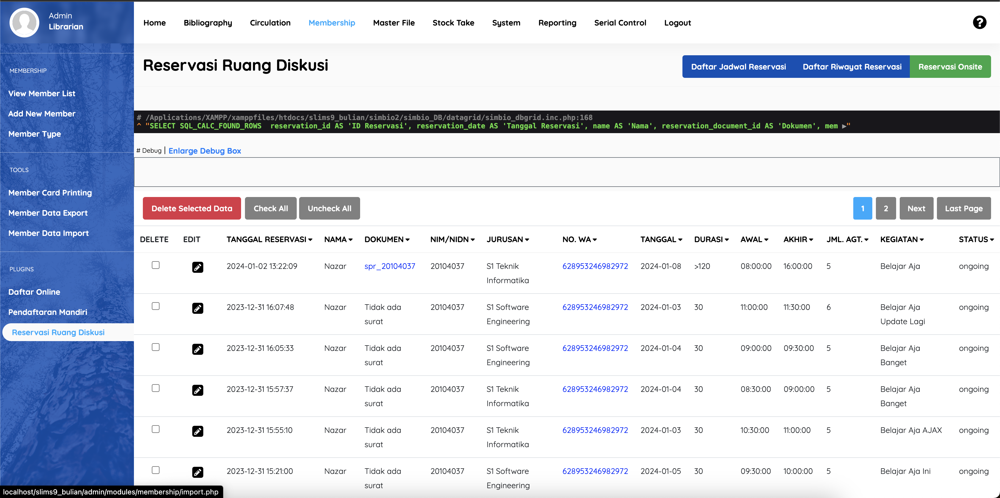
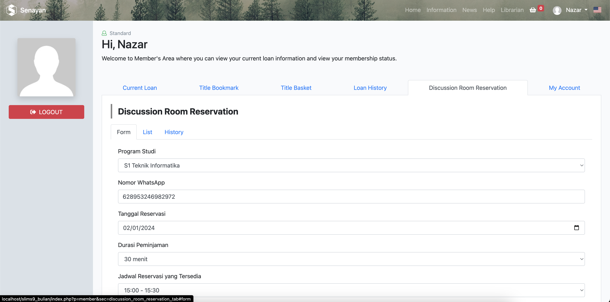
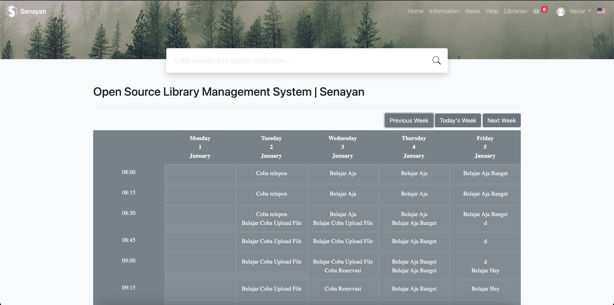

# Reservasi Ruang Diskusi

### Cara Install Plugin
1. Klik Code > Download Zip
2. Ekstrak file .zip nya ke folder `plugins/` yang ada di folder utama SLiMS Anda
3. Masuk modul **System** masuk menu **Plugins**. Cari plugin dengan nama **Reservasi Ruang Diskusi** kemudian aktifkan pluginnya.

### File structure

### Admin Area
Setelah plugin diaktifkan, menu reservasi dapat dilihat di modul **Membership** di bagian **Plugins > Reservasi Ruang Diskusi**.

### Member Area
Sesuaikan kode `index_member.php` dengan kode yang ada di file `lib/contents/member.inc.php`.
Seperti yang tertera pada dokumentasi SLiMS: [Membuat plugin modifikasi halaman pada OPAC](https://slims.web.id/docs/development-guide/Plugin/Membuat-plugin-modifikasi-halaman-pada-OPAC)

Jika sudah disesuaikan, maka fitur reservasi sudah dapat muncul di halaman member.

### Opac Area
Setelah plugin diaktifkan, jadwal reservasi ditampilkan di halaman Opac. Untuk mengaksesnya dapat menggunakan link `https://{slims_base}/index.php?p=jadwal_ruang_diskusi`.
