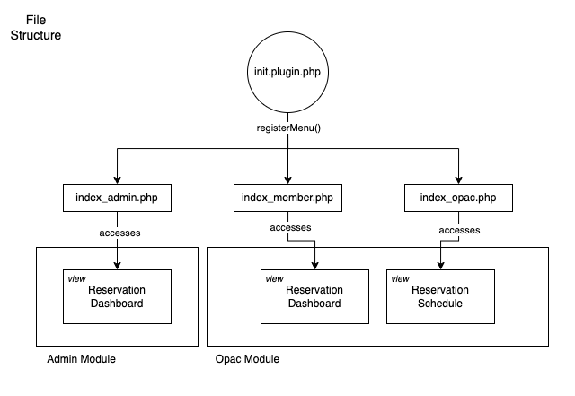

# Reservasi Ruang Diskusi

### Cara Install Plugin
1. Klik Code > Download Zip
2. Ekstrak file .zip nya ke folder plugins/ yang ada di folder utama slims Anda
3. Masuk module/modul System/Sistem masuk menu plugins,
Aktifkan pluginnya. Plugin akan muncul di module Membership.

### File structure

### Member area
Sesuaikan kode `index_member.php` dengan kode yang ada di file `lib/contents/member.inc.php`.
Seperti yang tertera pada dokumentasi SLiMS: [Membuat plugin modifikasi halaman pada OPAC](https://slims.web.id/docs/development-guide/Plugin/Membuat-plugin-modifikasi-halaman-pada-OPAC)
